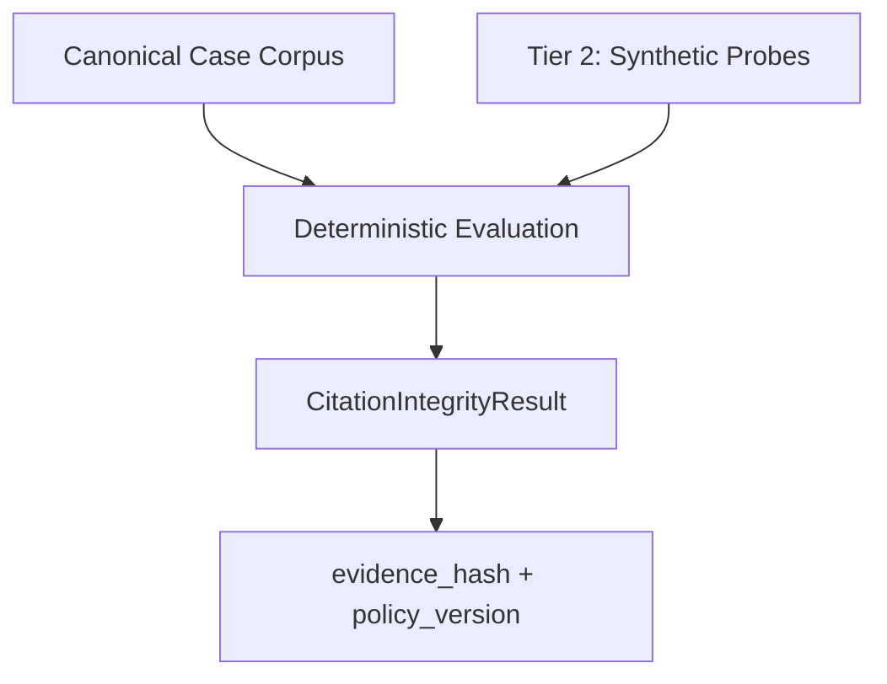

# Dali

The evidence layer for AI citation workflows.

The evidence layer for AI citation workflows.
---

## Table of Contents

- [What Dali measures](#what-dali-measures)
- [Architecture](#architecture)
- [Evaluation Tiers](#evaluation-tiers)
- [Tier 1 Canonical Case Corpus](#tier-1--canonical-case-corpus)
- [Quick start](#quick-start)
- [Examples](docs/examples.md)
- [Tier 2 Synthetic Probes](#tier-2--synthetic-probes)
- [Policy versioning](#policy-versioning)
- [Corpus quality gate](#corpus-quality-gate)
- [Anonymization](#anonymization)
- [Why Dali is not just another citation checker](#why-dali-is-not-just-another-citation-checker)
- [What this is not](#what-this-is-not)
- [What this enables](#what-this-enables)
- [How to cite](#how-to-cite)

---

## What Dali measures

Most citation evaluations focus on whether a generated citation exists or matches a source. Dali evaluates whether AI-assisted citation workflows remain reconstructable, attributable, and defensible under judicial scrutiny.

> A citation that was fabricated but is easily traced and corrected is a different risk category than a citation where no one can reconstruct which tool produced it, who reviewed it, or why it made it into the filing.

Dali measures both the output failure and the workflow gap.

---

## Architecture

The benchmark layers, artifact flow, and public/private boundary are documented in [docs/architecture.md](docs/architecture.md).



---

## Evaluation Tiers

Dali separates deterministic evaluation from live model probing.

| Tier | Corpus | Purpose |
|---|---|---|
| **Tier 1** | **Court-documented reference corpus** | Deterministic, policy-versioned ground truth |
| **Tier 2** | **Synthetic prompt probes** | Live model evaluation against real incident patterns |

Tier 1 is the benchmark standard. Tier 2 extends it to novel model behavior.

---

## Tier 1 — Canonical Case Corpus

The Canonical Case Corpus is the benchmark standard: court-documented AI-assisted citation failures with deterministic scoring, versioned taxonomy, and public-corpus anonymization.

See the concrete corpus preview, record fields, and evaluator command examples in [docs/examples.md](docs/examples.md).

### Cases vs prompts

Tier 1 uses canonical case records in `data/public/citation_failure_cases.json`. These are court-documented incidents such as Mata v. Avianca.

Tier 2 uses synthetic prompt probes under `synthetic/`. These are model-facing prompts for live evaluation and are not the canonical case corpus itself.

## Quick start

```bash
git clone https://github.com/yenk/Dali
cd Dali
python -m venv .venv
source .venv/bin/activate
pip install -r requirements.txt
python runners/run_integrity.py \
  --corpus data/public/citation_failure_cases.json \
  --output results/demo/integrity.json
```

This runs the deterministic Tier 1 evaluator locally without external services or hosted model access. For fuller examples, see [docs/examples.md](docs/examples.md).

Expected output:

```text
Loaded 4 canonical cases (3 scoring-eligible)
Results written to results/demo/integrity.json
```

The output JSON contains one `CitationIntegrityResult` per evaluated case, including reconstructability, defensibility risk, verification recoverability, and deterministic evidence hashes.

---

## Tier 2 — Synthetic Probes

Tier 2 ships 25 prompts across 5 logical categories. The runner also accepts user-supplied JSONL prompt directories with the same schema. See [docs/examples.md](docs/examples.md) for the concrete commands.

---

## Policy versioning

Every `CitationIntegrityResult` records a composite `policy_version`. The runner refuses to aggregate results from different policy versions without `--allow-cross-version`. See [POLICY_VERSIONING.md](POLICY_VERSIONING.md) for the sub-version table and bump rules.

---

## Corpus quality gate

Records are scoring-eligible only when they carry the required source, incident, status, and ground-truth fields. Missing records still load for inspection, but they are excluded from scoring aggregates. See [docs/examples.md](docs/examples.md) for the validator and corpus inspection flow.

---

## Anonymization

Attorney names are removed from the public corpus artifact. The anonymizer and regeneration flow are documented in [docs/examples.md](docs/examples.md).

---

## Why Dali is not just another citation checker

Dali does not only evaluate whether a citation exists. It evaluates whether the surrounding workflow remains reconstructable, attributable, and defensible under judicial scrutiny: which retrieval path produced the citation, whether verification occurred, whether provenance remained intact, and whether the result can be replayed under the same policy version.

Dali is not a thin LLM wrapper or probabilistic verifier; it uses deterministic, policy-controlled evaluation to assess whether the workflow remains attributable and reconstructable.

Dali treats citation integrity as one evidentiary signal inside a larger provenance and reconstructability system. Policy-versioned evaluation and deterministic evidence hashes allow benchmark results to be replayed and compared longitudinally without silent scoring drift.

> The benchmark standard is intentionally workflow-centric rather than prompt-centric.

---

## What this is not

This benchmark does not measure general factual accuracy, reasoning quality, or instruction-following. It focuses on citation lineage, provenance continuity, workflow attribution, and authority verification under evidentiary scrutiny.

---

## What this enables

The benchmark supports more than output-level citation evaluation. Using the Canonical Case Corpus and the shared `CitationIntegrityResult` contract, users can:

- evaluate AI-assisted citation workflows against real court-documented failures
- measure provenance continuity and workflow reconstructability
- test retrieval and RAG systems for authority integrity regressions
- generate synthetic mutation probes derived from real incidents
- compare citation integrity behavior across models or pipeline versions
- replay evaluations under fixed policy versions for reproducibility
- produce deterministic benchmark artifacts and evidence hashes
- study longitudinal citation drift and verification recoverability

---

## How to cite

```bibtex
@misc{dali-2026,
  title  = {Dali: AI Evidence Infrastructure for Citation Provenance and Workflow Defensibility},
  author = {Dali},
  year   = {2026},
  version = {0.2},
  url    = {https://github.com/yenk/Dali},
  note   = {Policy version: see POLICY_VERSIONING.md}
}
```
